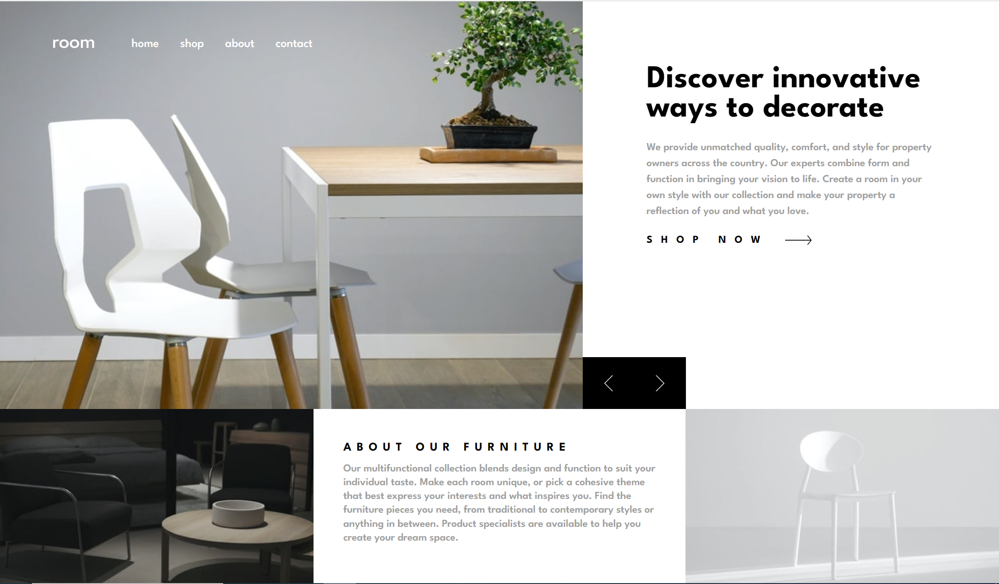

<h1 align="center">Room Homepage</h1>

challenge from <a href="https://www.frontendmentor.io">Frontend Mentor</a>

<h2 align="center"><a href="https://fm-room-homepage1.netlify.app/">🚀Live Site</a>||<a href="./README.md">README in English</h2></a>

画像、メッセージを切り替えられるイーコマースLP

## 💡Key Features

ユーザーは、

- 矢印の画像をクリックすることで画像、メッセージを切り替えることが可能。

## ⚒️Built with

- HTML
- SASS
- JavaScript
